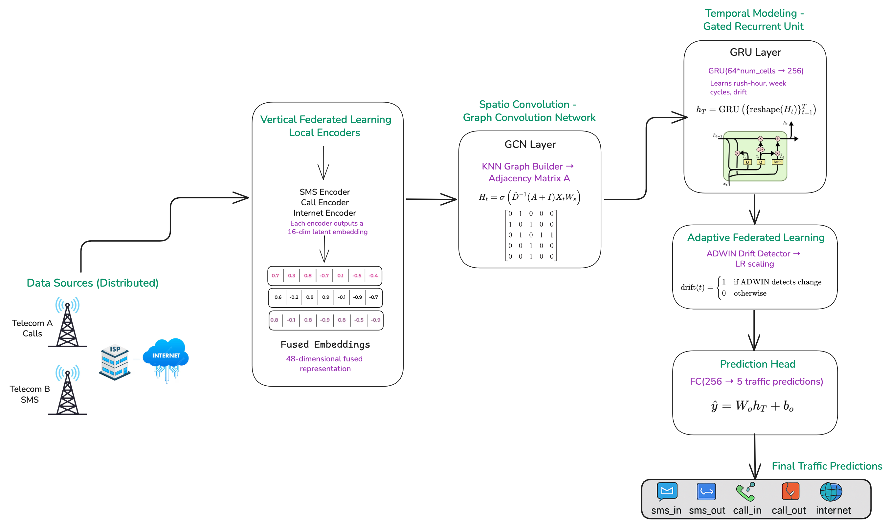
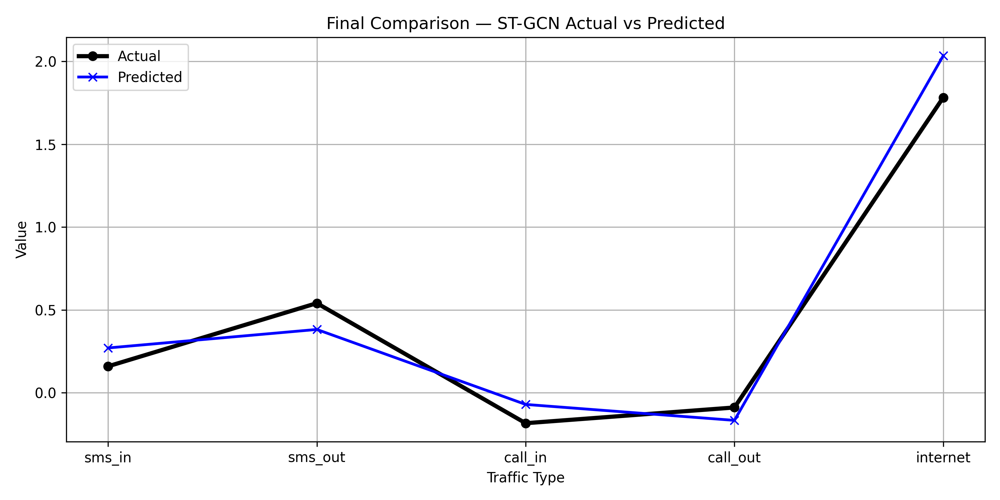

# Adaptive ST-VFL: A Drift-Aware Spatio-Temporal Vertical Federated Learning Framework for Cellular Traffic Prediction

This repository contains the implementation for **Adaptive Spatio-Temporal Vertical Federated Learning (Adaptive ST-VFL)**, a federated machine learning framework designed to accurately forecast multi-modal cellular traffic while preserving data privacy across distributed feature owners.

It integrates **vertical feature partitioning**, **graph-attention spatial modeling**, **temporal sequence learning**, and **adaptive drift detection (ADWIN)** to handle real-world, dynamic traffic environments.

The implementation builds on and improves limitations found in the base research:

📄 **Base Paper**: *Core network traffic prediction based on vertical federated learning and split learning* — https://www.nature.com/articles/s41598-024-53193-y

---

## Gaps and Limitations in the Base Approach

While the base paper contributes to federated traffic prediction, it exhibits several limitations:

1. **Missing Spatial Awareness**
   - Treats each cell tower independently, with no adjacency or graph.
   - Omits modeling of user mobility and handovers between neighboring cells.
   - Cannot capture propagation of congestion or spikes across the network.
   - Results in weak representation of real network topology.

2. **Limited Input Features**
   - Uses only historical traffic values as inputs.
   - Ignores external drivers such as weather, holidays, and special events.
   - Cannot adapt to temporal disruptions like rainfall, festivals, or emergencies.
   - Leads to underfitting in dynamic real-world conditions.

3. **No Concept Drift Handling**
   - Model is trained once and reused without adaptation.
   - No mechanism to detect or correct evolving traffic distribution shifts.
   - Predictive accuracy degrades significantly over time in non-stationary environments.

---

## Our Contributions and Improvements

To address these gaps, this project introduces:

1. **Vertical Federated Spatial-Temporal Prediction**
   - A federated learning framework using graph attention to capture dynamic spatial relationships while preserving feature-level privacy.

2. **Multimodal Feature Fusion**
   - Incorporates traffic metrics, weather data, holidays, and event indicators to improve robustness under real-world variability.

3. **Adaptive Optimization with Drift Detection**
   - Integrates ADWIN for concept drift detection, automatically adjusting learning behavior under changing traffic distributions.

---

## Architecture Overview

The architecture integrates five key components: vertical federated local encoders, multimodal feature fusion, KNN-based spatial graph convolution, GRU- based temporal modeling, and adaptive federated optimization with drift detection. Unlike traditional centralized forecasting models, this framework enables multiple data holders to collaboratively train a unified system without sharing raw feature data.

---

## Results

### Performance Comparison

| Model           | MSE       | MAE       |
|----------------|-----------|-----------|
| LSTM           | 0.386262  | 0.524459  |
| FedAvg         | 2.819680  | 1.112391  |
| VFL SplitNN    | 1.026500  | 0.715511  |
| **Adaptive ST-VFL** | **0.023998** | **0.142565** |

The framework achieves an MSE of 0.02399, outperforming the LSTM baseline (0.386) by approximately 93% and substantially surpassing FedAvg and VFL-SplitNN, confirming its effectiveness for real-world, non- stationary cellular traffic environments.

### Actual vs Predicted (Final Timestep)

The Adaptive ST-VFL model’s forecasts closely match the ground truth across all traffic modalities:

---

## Authors

This project was developed collaboratively by:

- [@rameenbabar](https://github.com/rameenbabar) — National University of Computer & Emerging Sciences
- [@batoolrizvi](https://github.com/batoolrrizvi) — National University of Computer & Emerging Sciences
- [@arishakhan](https://github.com/Arishakhan26) — National University of Computer & Emerging Sciences
- [@NabeelahMaryam](nabeelah.maryam@isb.nu.edu.pk) — National University of Computer & Emerging Sciences
- [@MohsinKhan](mohsin.khan@isb.nu.edu.pk) — National University of Computer & Emerging Sciences

